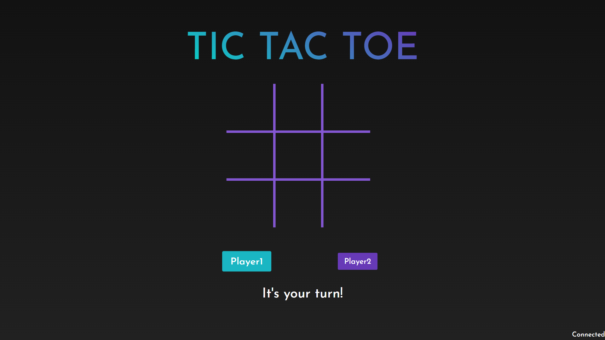
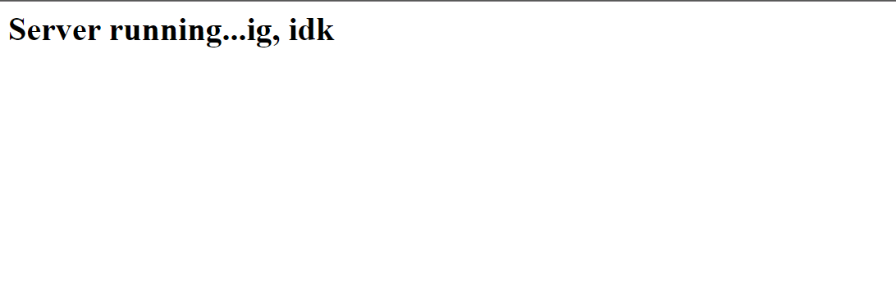

# Tic Tac Toe

# This is an online web based multiplayer Tic Tac Toe

## 
[The Game](https://vue-flask-tic-tac-toe.web.app/)

## Live Demo

 

## **Project setup on local machine**

- `git clone https://github.com/AnkushSarkar10/vue-flask-tic-tac-toe.git`

- `cd` inside the project directory

- **Setting up the flask server**

  - make sure you have python installed on your machine (this project uses version 3.8.10)
  - create a virtual enviornment using `virtualenv venv`
  - activate the virtual env `source venv/bin/activate` (on linux, google it for windows or mac)
  - install the packeges in `requirements.txt` by `pip install -r requirements.txt`
  - now start the server by `gunicorn -b :5000 --worker-class eventlet -w 1 app:app`
  - open `localhost:5000` on your web browser. If you see this your server is running.

 

 

- **Setting up the Vue app**

    - open `src/store.js` and uncomment line 18 and comment line 19 to change the socket source to the one running locally.
    - run `npm intsall` in the root directory of the project.
    - run `npm run serve` to run the app.
    - your app should be running on `localhost:8080`

 

## **Built With**

- Vue 3
- Flask
- Flask Socketio

 

## **Deployment**

- The [Flask server](https://tictactoe-server-flask.herokuapp.com/) is hosted on heroku.
- The [Vue App](https://vue-flask-tic-tac-toe.web.app/) is hosted on Firebase .

 

## **Contributers**

- Ankush Sarkar
- Me
- I
- Myself
